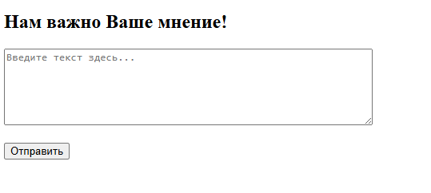
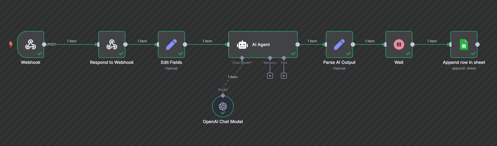
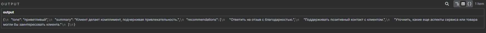
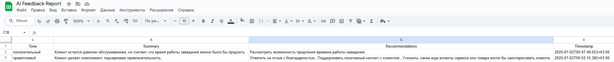

# 🧠 AI Feedback Assistant with n8n

This is a simple but powerful automation project that uses **n8n** and **OpenAI** to analyze user feedback and store the results in **Google Sheets**.

## 📌 Project Idea

Visitors submit feedback through a basic HTML form. The text is sent to an n8n workflow via a Webhook. Then, an AI agent analyzes it to extract:

- The tone of the message (positive / neutral / negative)
- A short summary
- Recommendations to improve customer experience

The results are stored in a Google Sheets file for further analysis.

---

## 🚀 How it works

1. **HTML form**  
   A small form sends user input to the webhook.  
   

2. **n8n Workflow**  
   The webhook triggers the AI pipeline:  
   - Prepares prompt
   - Sends it to the OpenAI Agent
   - Parses the result
   - Appends the outcome to a Google Sheet  
   

3. **Output from OpenAI**  
   

4. **Google Sheets Integration**  
   All feedback is stored with timestamps and recommendations.  
   

---

## 📁 Files

| File               | Description                            |
|--------------------|----------------------------------------|
| `Improve_My_Text.json` | n8n workflow export file             |
| `form.html`         | Feedback form (HTML version)           |
| `HTML.py`           | Same form, but rendered via Python     |
| `output.png`        | Screenshot of AI's JSON response       |
| `n8n_workflow.png`  | Workflow visual in n8n                 |
| `docs_feedback.png` | Example Google Sheets record           |

---

## ✅ Technologies Used

- [n8n](https://n8n.io/)
- OpenAI GPT-4o
- Google Sheets API
- HTML / Python

---

## 🔥 Why It Matters

This project demonstrates how to build an **AI-enhanced customer insights tool** with no-code automation. It can be used in business environments to:

- Classify and summarize user feedback
- Log complaints and praises
- Create instant reports for Customer Support teams

> Ideal for showcasing skills in automation, AI integration, and business logic development.
